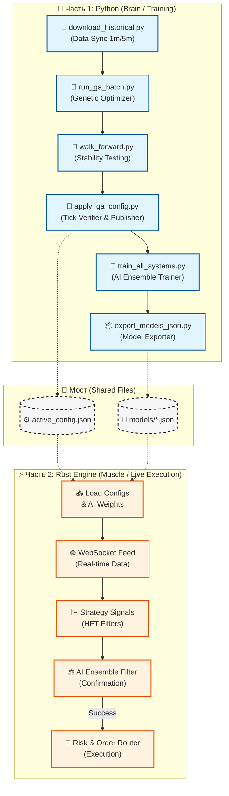
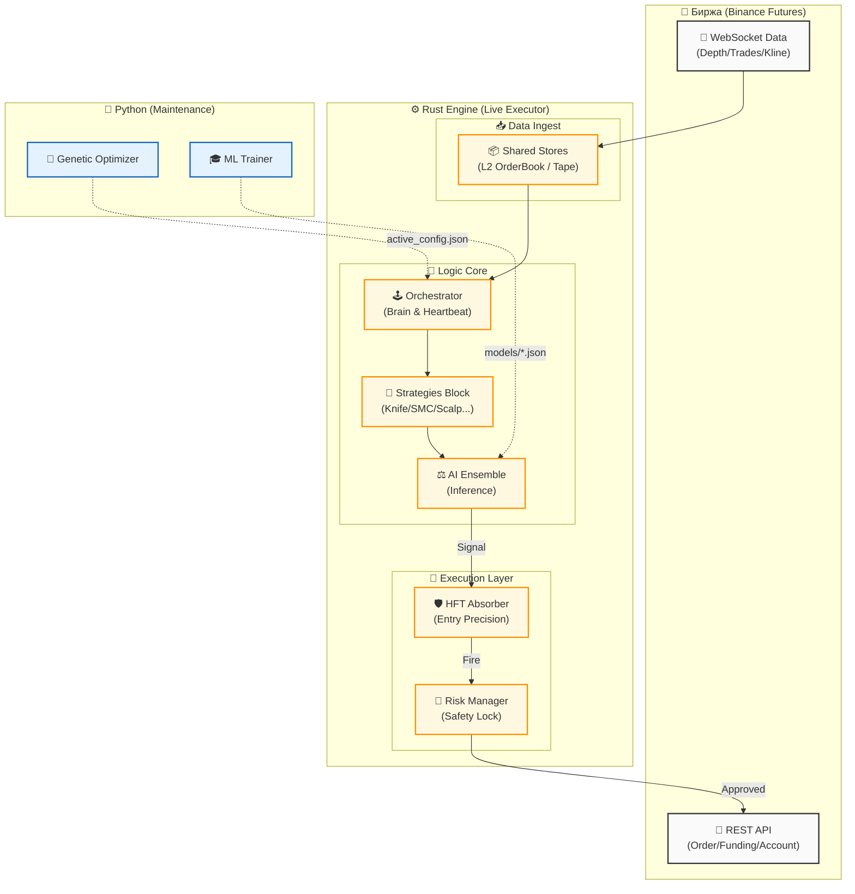
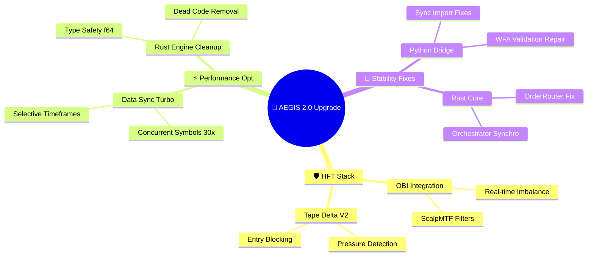
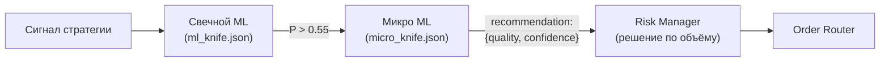
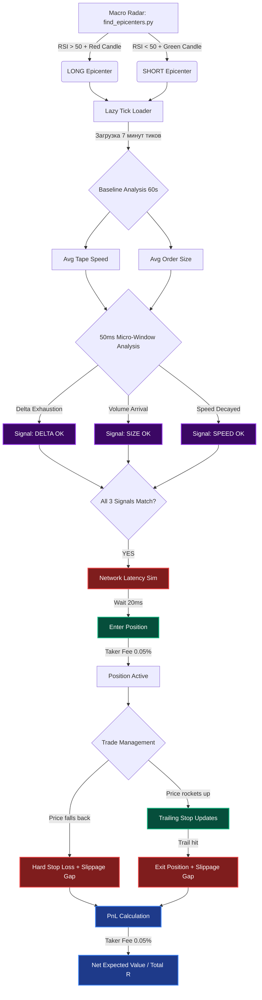
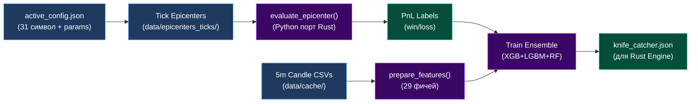

# AEGIS 2.0: Системная Спецификация и Архитектура

Данный документ содержит подробное описание работы торговой системы AEGIS 2.0, включая архитектуру взаимодействия компонентов, логику стратегий и механизмы управления рисками.

---

## 1. Обзор Архитектуры (High-Level Overview)

Система AEGIS 2.0 разделена на две части для обеспечения максимальной аналитической мощности (Python) и минимальной задержки исполнения (Rust).

---

## 2. Концепция Системы (Hybrid Intelligence)

AEGIS 2.0 построена на гибридной архитектуре:
*   **Python (Brain)**: Генетическая оптимизация параметров, обучение ML-ансамблей, Walk-Forward анализ и обучение **Meta-Model** (иммунитета).
*   **Rust (Muscle)**: Высокопроизводительное ядро для исполнения сделок в реальном времени. Обработка WebSocket-потоков, HFT-микроциклы, риск-менеджмент и **Meta-Inference** (динамическое управление риском).

---

## 3. Схема Потоков Данных (Architecture Flow)

---

## 4. Описание Компонентов (Rust)

### 3.1. Orchestrator (Оркестратор)
Центральный узел системы. Его функции:
*   **Heartbeat**: Тиковый цикл частотой ~100-200мс.
*   **Signal Routing**: Опрос всех стратегий на предмет новых сигналов.
*   **Hot-Swap (Phase 21)**: Динамическое переключение между Консервативным и Агрессивным набором параметров на основе текущей фазы рынка.
*   **Preprocessing**: Расчет индикаторов и агрегация свечей (1m, 5m, 15m) для всех символов.

### 3.2. Wall Tracker & Spot Screener (L2 Scanner)
Мониторинг книги ордеров глубиной до 100 уровней:
*   **Detection**: Поиск аномальных "стен" (плит) на фьючерсах.
*   **Spot Verification**: (Phase 11) Через `spot_probe.rs` система проверяет наличие аналогичных плотностей на СПОТОВОМ рынке. Если стена подкреплена реальным активом на споте — доверие (Score) к ней кратно возрастает.
*   **Tracking**: Отслеживание "возраста" стены и её "поедания" (eaten %). Плиты с высоким `touch_count` считаются подтвержденными уровнями.
*   **Spoofing Filter**: Сброс метрик при быстром переставлении лимиток.

### 3.3. Whale Flow Detector (Детектор Китов)
Двухуровневая система анализа крупных игроков (Phase 12):
*   **Layer 1 (Fast Burst)**: 5-секундное окно для детекции агрессивных рыночных серий. Генерирует алерты `WHALE_BUY` / `WHALE_SELL`.
*   **Layer 2 (EWMA Baseline)**: Система "нормализации". Для каждой монеты считается экспоненциальное среднее объема торгов. 
    *   **Baseline Provider**: Предоставляет данные другим модулям (`WallTracker`, `Sniper`) о том, какой объем считается "аномальным" для данной монеты в текущий момент.
*   **Session Awareness**: Система меняет пороги чувствительности в зависимости от торговой сессии (Азия, Европа, США).

### 3.4. Liquidation Radar (Радар Ликвидаций)
Мониторинг системного риска через поток `@forceOrder` (Phase 13):
*   **Velocity Z-Score**: Вычисляет аномальное ускорение ликвидаций. Если Z-Score > 3.0σ — фиксируется **Каскад**.
*   **Systemic vs Isolated**: Если ликвидации идут по BTC и 3+ альтам одновременно — радар объявляет системный шторм.
*   **Impact**: 
    *   **Trend Strats (SMC/Scalp)**: Блокируются (WARN 5мин), чтобы не входить "в нож".
    *   **KnifeCatcher**: Переходит в режим `PREPARE`. Вход разрешается только в момент затухания каскада (снайперский контр-трейд).

### 3.5. Sniper Confirmation (Финальный Фильтр)
Метод `sniper_confirm` в Оркестраторе — это "последний рубеж" перед отправкой ордера:
1.  **Dynamic Threshold**: Устанавливает порог значимости стены как 20% от макро-порога волатильности монеты.
2.  **Order Flow Analysis**: Проверка дисбаланса ленты (Imbalance > 1.2), дельты и наличия " Whale Prints" в сторону сделки.
3.  **Wall Check**: Если перед ценой стоит стена, вход разрешен только если она "проедена" более чем на 30%.
4.  **Spoofer Detection**: Если под ценой (при лонге) внезапно появилась свежая плита (< 5 мин) — это считается алгоритмической поддержкой "спуфера" и повышает вероятность входа.

### 3.7. Scalp Monitor (Микро-менеджмент)
Специализированный цикл для управления скальп-позициями (Phase 10):
*   **Polling Loop**: 100мс цикл опроса состояния ленты и стакана после входа.
*   **Conditions**: Автоматический выход при исчезновении защитной плиты (`WallGone`), появлении скрытых айсбергов против позиции (`IcebergAgainst`) или зеркальном развороте дельты.
*   **Wall-TP**: Автоматический перенос Тейк-Профита на ближайшую обнаруженную стену в стакане.

### 3.8. Smart Trailer (Умный Трейлинг)
Композитный движок фиксации прибыли (Phase 11):
*   **Composite Score**: Считается на основе дисбаланса стакана (30%), дельты ленты (50%) и тренда CVD (20%).
*   **Behavior**: 
    *   При сильном импульсе — затягивает трейлинг-стоп для максимизации выгоды.
    *   При затухании импульса — фиксирует 50% позиции и переводит остаток в безубыток.
    *   При резком развороте — принудительно закрывает позицию по рынку (Smart Exit).

---

## 5. Логика Стратегий

### 4.1. Knife Catcher (Ловец Ножей)
*   **Суть**: Поиск точек разворота после экстремальных импульсов (Mean Reversion).
*   **Условия входа**: Цена выходит за границы Bollinger Bands (2.5-3.0σ) + всплеск волатильности ленты.
*   **Защита**: Обязательное наличие плотности (стены) в стакане, от которой ожидается отскок.
*   **Стоп-лосс**: Математически прячется ЗА защитную стену.

### 4.2. SMC (Smart Money Concepts)
*   **Суть**: Торговля по структуре рынка профессиональных участников.
*   **Ключевые паттерны**:
    *   **MSS (Market Structure Shift)**: Смена локального тренда.
    *   **OB (Order Block)**: Зона интереса крупного игрока.
    *   **FVG (Imbalance)**: Ценовые разрывы, требующие заполнения.
*   **Логика**: Вход на откате в Order Block после подтвержденного слома структуры.

### 4.3. Density Breakout (Пробой Плотности)
*   **Суть**: Торговля импульса при капитуляции крупного лимитного игрока.
*   **Условия**: Многократное тестирование крупной плиты (`touch_count > 2`) + агрессивное "поедание" стены по ленте.
*   **HFT Триггер**: Всплеск CVD в сторону пробоя + ускорение ленты принтов (паника).

### 4.4. ScalpMTF (Мультифреймовый Скальпинг)
*   **Суть**: Торговля по тренду на младших ТФ с подтверждением от старших.
*   **Логика**: Поиск "золотого сечения" (отката) на 1м-графике при условии, что 15м-тренд (EMA20) направлен в ту же сторону.
*   **HFT Filter**: Вход подтверждается только при наличии дисбаланса стакана (OBI > 0.1) и отсутствии контр-движения по ленте сделок (Tape Delta).
*   **Управление**: После входа управление немедленно передается в `ScalpMonitor` для микроструктурного сопровождения.

### 4.5. Funding Rate Reversion
*   **Суть**: Эксплуатация перекоса плеч на рынке деривативов.
*   **Условия**: Крайние значения фандинга (> 0.05% или < -0.05% за 8ч) + подтверждение разворота через ленту сделок (Tape Delta).
*   **ML Filter**: Теперь проходит через ансамбль нейросетей для фильтрации «ложных» разворотов на сильном импульсе.

---

## 6. Обновления AEGIS 2.0 (Март 2026)

В ходе недавней модернизации (HFT-стек) были внедрены следующие критические изменения:
1.  **SMC Synchro**: Полная синхронизация логики Order Block и FVG между Rust и Python. Исправлена ошибка `lookahead bias`.
2.  **ScalpMTF (OBI + Tape)**: Скальпер 1м-таймфрейма теперь использует дисбаланс стакана (OBI) как первичный фильтр.
3.  **Data Sync Opt**: Реализована выборочная загрузка таймфреймов, ускорившая синхронизацию в 5 раз.
4.  **Funding ML**: Внедрена Python-реализация для Funding Rate с использованием ML-ансамбля.
5.  **Quantum Accuracy (Phase 20)**:
    - **Recency Weighting**: Система затухания веса сделок (Time-Decay). Новые данные имеют приоритет.
    - **Stress Testing**: Интеграция волатильности BTC в фитнес-функцию GA. Штрафы за «случайный» профит в шторм.
6.  **Sniper Dynamic**: Механизм `sniper_confirm` теперь динамически рассчитывает пороги стен на основе ATR.

### 🗺️ Mindmap: HFT & Optimization Sprint (March 2026)

---

### 5.4. Risk Modulation (Модуляция Риска)
Динамическое управление объемом на основе предсказаний Meta-Model:
*   **Green (Score 80-100)**: 100% расчетного объема. Уверенная зона.
*   **Yellow (Score 40-79)**: 50% объема. Повышенная осторожность (WARN).
*   **Red (Score < 40)**: Микро-лот (0.01 от риска). Бот входит минимальной позицией для сбора данных об исполнении (слиппидж, комиссия) для дообучения модели без финансовых рисков.

> [!IMPORTANT]
> Система игнорирует модуляцию (100% вход), если в обучающей выборке Meta-Model меньше 50 сделок.

---

## 7. Механика Выхода (Exit Management)

*   **Dynamic Take Profit**: Настройка через GA индивидуально для каждой стратегии.
*   **Tape-based Exit**: (В разработке) Выход по затуханию импульса ленты, не дожидаясь стопа или тейка.
*   **Trailing Stop**: Адаптивный подтяг стопа в безубыток после достижения первого буфера прибыли (First Buffer).

## 8. Квантовый Размах (Phase 22: Quantum Scale) 🌌

Текущий вектор развития направлен на достижение неограниченной вычислительной мощности и самообучения.

### 8.1. Binary Backtest Engine (Bit-Masking)
Переход от древовидной логики `if/else` к бинарным маскам сигналов:
*   **BitsetSignals**: Каждая свеча представляется как `u64/u128` маска технических и HFT условий.
*   **SIMD Parallelism**: Использование векторных инструкций процессора для одновременной обработки тысяч вариантов параметров.
*   **Performance Goal**: Снижение времени одного прогона бэктеста до **1 микросекунды** (ускорение x1000).

### 8.2. Master Advisor (Meta-Learning)
Автономный слой принятия решений, работающий поверх стратегий:
*   **Journal Feedback**: Постоянный анализ `trade_log.jsonl` для выявления паттернов убыточных сделок в живом режиме.
*   **Negative Labeling**: Если Advisor видит условия, при которых стратегия исторически теряет деньги (даже если сигнал «валиден»), он блокирует вход.
*   **Adaptive Risk**: Модуляция плеча в зависимости от текущей фазы рынка и производительности конкретного сетапа.

## 9. Физика Тиков (Phase 23: Market Microstructure) 🔬

Новейший слой HFT-анализа, работающий с сырыми aggTrades-тиками. Реализован в `microstructure_analyzer.py`.

### 9.1. Архитектура (Recommendation Pipeline)

Микро ML **не блокирует** сделку напрямую. Он выдаёт **рекомендацию** `{quality: STRONG/WEAK/LOSS, confidence: 0.85}`, а Risk Manager учитывает её при расчёте объема входа.

### 9.2. Метрики по стратегиям

**KnifeCatcher** (окно 30-60 сек ДО входа):
*   `dump_speed` — % падения / секунду
*   `capitulation_vol` — объём капитуляции за 3 сек перед дном
*   `bounce_speed` — скорость V-отскока (первые 5 сек)
*   `tick_density_at_low` — тиков на дне (абсорбер)
*   `panic_decay_rate` — затухание паники (Sell: последние 10с / первые 10с)

**Density / Breakout** (окно 30-60 МИН ДО входа):
*   `consolidation_time` — минуты у уровня, `touch_count_ticks` — касания ±0.01%
*   `pre_break_accel` — ускорение объёма (10с vs 60с), `buy_sell_ratio_5s` — агрессия Buy
*   `retreat_depth` — глубина откатов, `volume_profile` — концентрация объёма

**FundingRate_MR** (окно 5-15 мин): `liquidation_cascade`, `spread_widening`

**Ultimate_SMC_Trail** (окно 5-30 мин):
*   `ob_absorption` — объём поглощения в OB, `fvg_fill_speed` — скорость заполнения FVG
*   `mss_tick_confirm` — объём при сломе структуры, `sweep_volume` — объём sweep
*   `imbalance_ratio` — дисбаланс Buy/Sell в зоне OB

**ScalpMTF** (окно 1-5 мин):
*   `tape_momentum`, `micro_trend_consistency`, `slippage_estimate`, `iceberg_detection`

### 9.3. Multi-Class Labels
XGBoost (`multi:softprob`): **STRONG_WIN** (≥1.5R) / **WEAK_WIN** (0..1.5R) / **LOSS** (≤0).

### 9.4. Источник тиков (Phase 24: Binance Vision)
Тики загружаются через `lazy_tick_loader.py` из ZIP-архивов `data.binance.vision`. Кэш: `data/cache/ticks/{SYMBOL}/{DATE}.csv`.

---

## 10. HFT Спецификации (Phase 25: Knife Tick v3.0) 🔪

Стратегия `Knife Tick` — это высокочастотный контр-трендовый алгоритм для фьючерсов Binance. Его цель: находить аномальные панические распродажи (или FOMO-покупки) на высоковолатильных альткоинах (high-beta) и входить в сделку ровно в ту миллисекунду, когда агрессивный поток рыночных ордеров истощается, уступая место откату.

Стратегия **не использует традиционные технические индикаторы** (MACD, пересечения скользящих средних, дивергенции) для точки входа. Вместо этого она анализирует "голую физику" микроструктуры в стакане: реальные сделки (тики) и поведение агрессоров.

### Блок-схема пайплайна (Mind Map)

### 10.1 Микроструктурный триггер входа (Physics Engine)
Когда контр-трендовый эпицентр найден, движок загружает тики за 7 минут. Рассчитывается **Baseline (базовая линия)** 60 секунд. 
Точка входа в "окне истощения" (`µwin` = 20-150 мс) требует совпадения 3 сигналов:
1. **Скорость ленты (Tape Speed - `spd`):** Замедление ленты до порога (`tps < baseline * 2.5`). Пик паники пройден.
2. **Размер агрессора (Order Size - `size`):** Ждем крупного игрока или обычный принт (`avg_size > baseline * min_size_mult`).
3. **Истощение Дельты (Delta - `δ`):** Чистая дельта успокаивается, агрессоры не давят стакан.

### 10.2 Движок симуляции и реализм (The Truth Machine)
Алгоритм включает три жесточайших фильтра реальности (предотвращение оверфиттинга):
1. **Торговые комиссии (Exchange Fees)**: `0.05%` на вход и выходи (0.1% Round-trip).
2. **Сетевая Задержка (Ping Latency)**: Вшито `network_latency_ms = 20`. Ордер исполняется на тике спустя 20мс после сигнала.
3. **Тиковое проскальзывание (Slippage)**: Если гэп перепрыгнул стоп, позиция закрывается по факту пробившего тика (иногда расширяя убыток в 1.5 раза).

### 10.3 Управление позицией (Trade Management)
Жесткий Take-Profit отключен. Позиция управляется через:
- **Hard Stop-Loss (`sl_pct`):** Физический стоп `0.25% - 0.45%`.
- **Trailing Stop (`trail_pct`):** Скользящая защита `0.35% - 0.45%` от локального пика.

### 10.4 Генетические параметры (Геном из 11 генов)
Оптимизатор DE подбирает 11 параметров для каждой монеты:
1. `win_ms` (100-10000 мс): Окно поиска триггера возле эпицентра.
2. `min_drop` (0.1-1.0%): Глубина пролива (длина ножа).
3. `tp_pct` (Отключен аппаратно).
4. `sl_pct` (0.05-1.0%): Физический стоп-лосс.
5. `micro_win_ms` (10-2000 мс): Окно пульса микроструктуры.
6. `be_trigger` (0.1-1.0%): Порог включения безубытка.
7. `trail_pct` (0.1-1.0%): Отступ трейлинг-стопа.
8. `min_micro_delta_mult` (-2.0..+2.0): Порог истощения дельты.
9. `min_size_mult` (0.5-5.0): Множитель размера приходящего объема ордеров.
10. `max_speed_mult` (0.1-5.0): Граница замедления ленты.

### 10.5 ML Training Pipeline (Обучение ансамбля) 🧠

Скрипт `train_ml_knife_tick.py` — основной пайплайн обучения ML-фильтра для knife_tick.

**Архитектура данных:**

**Источники данных:**
*   **PnL Labels**: Тиковые эпицентры (`data/epicenters_ticks/{SYMBOL}/{LONG|SHORT}/{ts}.csv`). Каждый эпицентр оценивается функцией `evaluate_epicenter()` — точный порт Rust-логики с micro-delta, breakeven, trailing SL и тиковым проскальзыванием.
*   **Features (29 штук)**: Извлекаются из 5m свечей в момент эпицентра через `prepare_features()`, что зеркалит Rust `ml_inference::extract_features()`. Ключевые: `atr_pct`, `dist_to_ema`, `btc_dump_3c`, `rsi_14`, `adx_14`, `volume_ratio`.

**Streaming-архитектура**: Эпицентры обрабатываются по одному (numpy arrays, `del ticks` сразу после оценки) для минимального потребления RAM при сотнях тысяч тиков.

**Ансамбль (Triple-AI):**

| Модель | Роль | Trees |
|--------|------|-------|
| XGBoost | Нелинейные паттерны | 100 |
| LightGBM | Быстрый, табулярный | 100 |
| Random Forest | Стабильность, anti-overfit | 100 |

Финальное решение = среднее вероятностей трёх моделей. Порог: `≥ 0.5` → сделка одобрена.

**Экспорт**: LightGBM-часть экспортируется в `data/models/knife_catcher.json` для нативного Rust инференса (`ml_inference.rs`).

**Результат последнего обучения (2026-03-27):**
*   Датасет: **5863** сделки × 31 символ
*   Raw WR: 46.1% → **ML Accuracy: 63.8%**, Precision: 61.8%

---

## 11. Мульти-Агентная Интеграция (Phase 50: MiroFish Swarm AI) 🐟🧠

В будущем (Phase 50) планируется интеграция движка роевого интеллекта (Swarm Intelligence engine) на базе архитектуры **MiroFish**.
*   **Концепция**: Использование кластера AI-агентов (мульти-агентная система), которые параллельно анализируют разнородные данные (социальный сентимент, новостной фон, ончейн-метрики китов и макро-экономику).
*   **Механика консенсуса**: Агенты дискутируют и формируют единый вероятностный прогноз (Predicting Anything) до начала формирования микроструктурных паттернов.
*   **Интеграция с AEGIS**: Прогноз Swarm AI служит макро-фильтром (Meta-Inference layer). Если "рой" предсказывает дамп рынка, HFT-стратегии могут переводиться в режим `SHORT-ONLY` или отключаться для защиты капитала.

---
*Документация обновлена: 2026-03-27 (Добавлена секция 10.5: ML Training Pipeline)*

